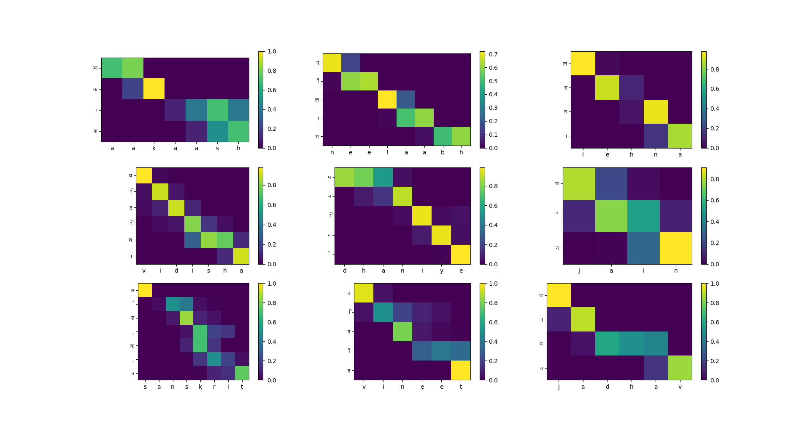

# Attention-Based Neural Transliteration

This repository contains a PyTorch implementation of an attention-based sequence-to-sequence model for transliteration tasks, specifically designed for Hindi-English transliteration using the Dakshina dataset.

## Table of Contents
- [Overview](#overview)
- [Architecture](#architecture)
- [Features](#features)
- [Dataset](#dataset)
- [Setup](#setup)
- [Usage](#usage)
- [Attention Visualization](#attention-visualization)

## Overview

Transliteration is the process of converting text from one writing system to another while preserving pronunciation. This project implements a neural approach to transliteration using sequence-to-sequence models with Bahdanau attention mechanism.

The implementation provides:
- A flexible encoder-decoder architecture
- Support for multiple RNN cell types (LSTM, GRU, RNN)
- Bahdanau attention mechanism
- Visualization of attention weights
- Hyperparameter tuning with Weights & Biases

## Architecture

The model consists of three main components:

1. **Encoder**: Processes the input sequence and produces a sequence of hidden states.
   - Character-level embedding
   - Multi-layer RNN (configurable: LSTM/GRU/RNN)

2. **Bahdanau Attention**: Computes attention weights for each encoder state at each decoding step.
   - Energy-based alignment model
   - Produces context vectors focusing on relevant input characters

3. **Decoder**: Generates the output sequence one character at a time.
   - Character-level embedding
   - Multi-layer RNN with attention
   - Output projection layer

## Features

- Character-level tokenization and embedding
- Teacher forcing during training
- Dynamic padding and batching
- Attention visualization via heatmaps
- Customizable model hyperparameters
- Support for different RNN cell types
- Hyperparameter optimization with W&B sweeps

## Dataset

This model is trained on the Dakshina dataset, which contains transliteration pairs for various Indian languages. The implementation specifically uses the Hindi-English transliteration pairs.

The dataset should be structured as tab-separated files with the following format:
```
target_language_text \t source_language_text \t count
```

## Setup

1. Clone the repository:
   ```bash
   git clone https://github.com/username/attention-transliteration.git
   cd attention-transliteration
   ```

2. Install dependencies:
   ```bash
   pip install torch pandas numpy matplotlib seaborn wandb tqdm
   ```

3. Download the Dakshina dataset from the [official source](https://github.com/google-research-datasets/dakshina) or prepare your own transliteration dataset in the required format.

## Usage

### Training

```python
python train.py --data_path /path/to/dakshina --language hi --epochs 10
```

Optional arguments:
- `--embed_size`: Embedding dimension (default: 128)
- `--hidden_size`: Hidden state dimension (default: 128)
- `--attn_size`: Attention dimension (default: 64)
- `--num_layers`: Number of RNN layers (default: 2)
- `--cell_type`: RNN cell type (LSTM, GRU, RNN) (default: LSTM)
- `--dropout`: Dropout rate (default: 0.3)
- `--batch_size`: Batch size (default: 32)
- `--lr`: Learning rate (default: 0.001)

### Hyperparameter Optimization

```python
python sweep.py --data_path /path/to/dakshina --language hi
```

### Evaluation and Visualization

```python
python evaluate.py --model_path best_model.pth --data_path /path/to/test_data
```


## Attention Visualization

The model includes functionality to visualize attention weights, showing how the decoder attends to different parts of the input sequence at each decoding step:



The attention heatmaps demonstrate how the model focuses on specific input characters when generating each output character, providing insights into the transliteration process.

