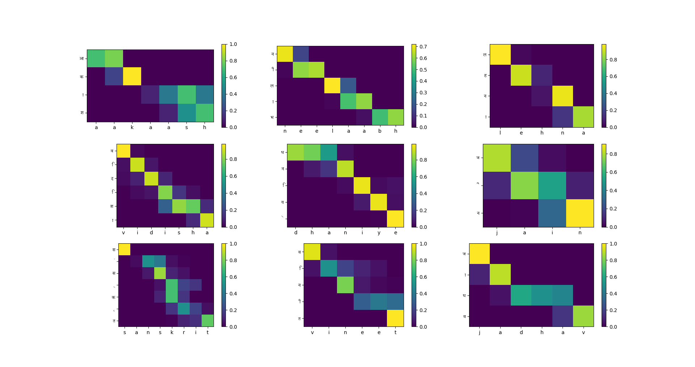

# Hindi-English Transliteration Models

This repository contains implementations of Sequence-to-Sequence (Seq2Seq) models for Hindi-English transliteration using the Dakshina dataset, with two different approaches:

1. **Vanilla Seq2Seq** - Basic encoder-decoder RNN architecture
2. **Attention-based Seq2Seq** - Enhanced architecture with attention mechanism

## Project Structure

```
├── Attention/
│   ├── predictions_attention/     # Prediction results from attention model
│   ├── Attention.ipynb            # Jupyter notebook with attention implementation
│   ├── allHeatMaps.png            # Visualization of attention weights
│   ├── attention.py               # Python script for attention-based model
│   └── readme.md                  # Specific documentation for attention model
├── Vanilla/
│   ├── predictions_vanilla/       # Prediction results from vanilla model
│   ├── Vanilla.ipynb              # Jupyter notebook with vanilla implementation
│   ├── vanilla.py                 # Python script for vanilla Seq2Seq model
│   └── readme.md                  # Specific documentation for vanilla model
├── Question1.py                   # RNN based seq2seq model
├── Question1.ipynb                # RNN based seq2seq model
├── Question6.py                   # Visualizing Connectivity
├── Question6.ipynb                # Visualizing Connectivity
└── README.md                      # Main README.md
```

## Overview

This project implements and compares two approaches to transliteration:

1. **Vanilla Seq2Seq**: A standard encoder-decoder architecture using recurrent neural networks (RNN/GRU/LSTM) that encodes the source sequence into a fixed-length vector and decodes it into the target sequence.

2. **Attention-based Seq2Seq**: An enhanced architecture that allows the decoder to focus on different parts of the input sequence during each decoding step, addressing the limitations of compressing all information into a fixed-length vector.

## Task Description

Transliteration is the process of converting text from one script to another while preserving the pronunciation. In this project, we focus on Hindi to Latin script (Romanization) transliteration using the Dakshina dataset.

## Key Features

- **Multiple RNN Cell Types**: Support for RNN, GRU, and LSTM cells
- **Beam Search Decoding**: Enhanced decoding strategy for improved output quality
- **Attention Mechanism**: Visual attention to focus on relevant input characters
- **Hyperparameter Optimization**: Using Weights & Biases (wandb) for tuning
- **Visualization**: Attention weight visualization to understand model behavior

## Requirements

- Python 3.6+
- PyTorch 1.0+
- pandas
- wandb (Weights & Biases)
- tqdm
- matplotlib (for visualizations)

## Installation

```bash
pip install torch pandas wandb tqdm matplotlib
```

## Data

This project uses the Dakshina dataset for Hindi-English transliteration:

```
/kaggle/input/dakshina-dataset/hi/lexicons/
├── hi.translit.sampled.train.tsv
├── hi.translit.sampled.dev.tsv
└── hi.translit.sampled.test.tsv
```

Each file contains tab-separated values with the following format:
```
target_word    source_word    count
```

## Comparison of Models

| Model | Test Accuracy | Inference Speed | Benefits |
|-------|---------------|----------------|----------|
| Vanilla Seq2Seq | ~34.70% | Faster | Simpler architecture, fewer parameters |
| Attention Seq2Seq | ~35.56% | Slower | Better handling of long sequences, improved accuracy |

## Setup

1. Clone the repository:
   ```bash
   git clone https://github.com/Rajnishmaurya/da6401_assignment3
   cd da6401_assignment3
   ```

2. Install dependencies:
   ```bash
   pip install torch pandas numpy matplotlib seaborn wandb tqdm
   ```

3. Download the Dakshina dataset from the [official source](https://github.com/google-research-datasets/dakshina) or prepare your own transliteration dataset in the required format.


## Usage

### Vanilla Model

```python
python Vanilla/vanilla.py
```

### Attention Model

```python
python Attention/attention.py
```

### Hyperparameter Optimization

Both models include hyperparameter sweep configurations using Weights & Biases:

```python
sweep_id = wandb.sweep(sweep_config, project="dakshina-transliteration")
wandb.agent(sweep_id, function=main, count=25)
```

## Results Visualization

The attention model generates visualizations of attention weights, showing which input characters the model focuses on when generating each output character:



## Detailed Documentation

For more specific information about each model:

- [Vanilla Seq2Seq Documentation](Vanilla/readme.md)
- [Attention Seq2Seq Documentation](Attention/readme.md)

## Link
[Github Link](https://github.com/Rajnishmaurya/da6401_assignment3/tree/main)  
[Wandb Report](https://api.wandb.ai/links/da24m015-iitm/xhh9mouq)